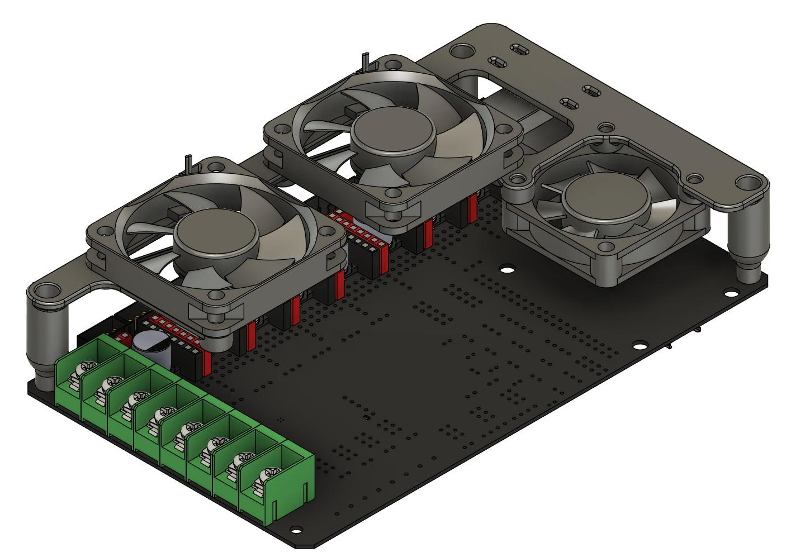
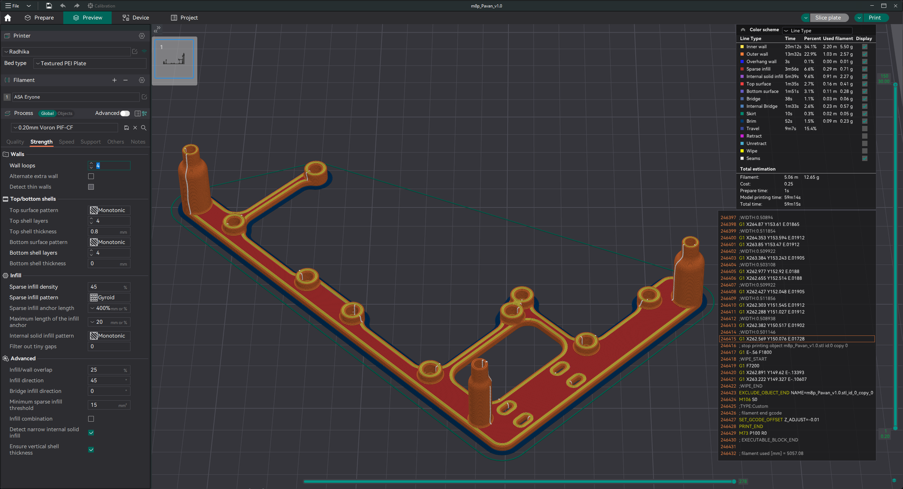

# m8p-Pavan

**M8P Pavan - BTT Manta M8P Fan Mount for Cooling Stepper Drivers**

This repository contains the files for the BTT Manta M8P Pavan stepper motor fan mount.

## Features
- **Designed to fit over the Manta M8P stepper motor drivers.**
- **Fans:** Two 5010 fans for the stepper motor drivers and one 4010 fan for the CB/CM4.
- **Requires Manta M8P Voron mount.**

## Contents
- **CAD:**
  - Contains the STL files for 3D printing.
  - STEP and F3Z files included for modifications.
- **Images:**
  - Photos of the mount.

## Printing
- Print using standard Voron settings (4 walls, 5 top & bottom laters, 40% infill).
- 5.10 gm of material usage.
- Check  for print orientation.

## Assembly
1. Insert the M3 4x5mm heat sets into the designated holes on the printed parts.
2. Attach the two 5010 fans to the mount using M3x16 screws.
3. Mount the 4010 fan for the CB1 or CM4 using M3x16 screws.
   - The fan can be mounted underneath when using CM4 (untested with CB1).
4. Secure the assembled mount to the Manta DIN mount.

## BOM
- 9x M3 4x5mm heat sets.
- 12x M3x16 SCBH screws.
- 2x 5010 fans.
- 1x 4010 fan.